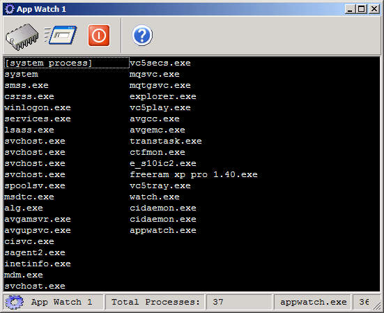



## Application Watcher ver1 Atlast i uploaded it\!

### Description

Acts as your taskmanager PLUS Can prevent application from running in your system and also screensavers, it automatically attaches itself on system startup! Try it out and vote for it(password:monitor)
 
### More Info
 

             |
---                |---
**Submitted On**   |2004-09-03 22:03:36
**By**             |[jheikage](https://github.com/Planet-Source-Code/PSCIndex/blob/master/ByAuthor/jheikage.md)
**Level**          |Advanced
**User Rating**    |5.0 (15 globes from 3 users)
**Compatibility**  |VB 6\.0
**Category**       |[Complete Applications](https://github.com/Planet-Source-Code/PSCIndex/blob/master/ByCategory/complete-applications__1-27.md)
**World**          |[Visual Basic](https://github.com/Planet-Source-Code/PSCIndex/blob/master/ByWorld/visual-basic.md)
**Archive File**   |[Applicatio1802701082004\.zip](https://github.com/Planet-Source-Code/jheikage-application-watcher-ver1-atlast-i-uploaded-it__1-56606/archive/master.zip)

